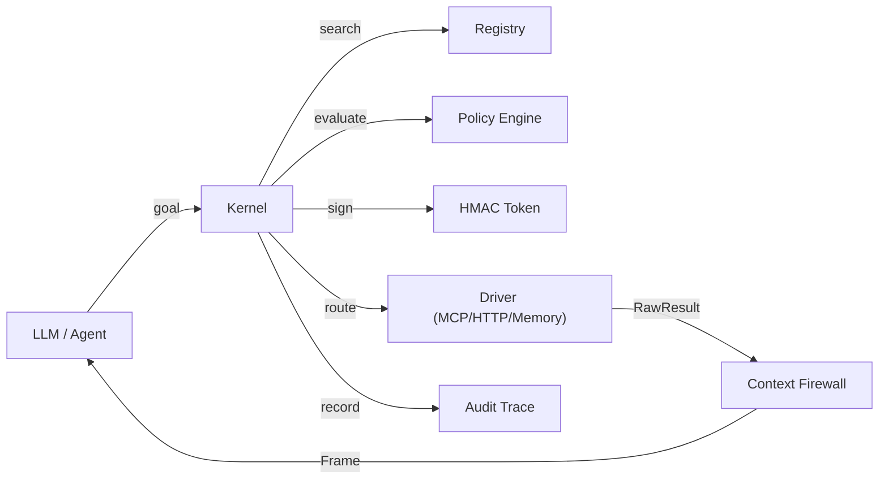

# agent-kernel

[](https://github.com/dgenio/agent-kernel/actions/workflows/ci.yml)
[](https://www.python.org/)
[](LICENSE)

A capability-based security kernel for AI agents operating in large tool ecosystems (MCP, A2A, 1000+ tools).

## 30-second pitch

Modern AI agents face three hard problems when given access to hundreds or thousands of tools:

1. **Context blowup** — raw tool output floods the LLM context window.
2. **Tool-space interference** — agents accidentally invoke the wrong tool or escalate privileges.
3. **No audit trail** — there's no record of what ran, when, and why.

`agent-kernel` solves all three with a thin, composable layer that sits above your tool execution layer:

- **Capability Tokens** — HMAC-signed, time-bounded, principal-scoped. No token → no execution.
- **Policy Engine** — READ/WRITE/DESTRUCTIVE safety classes + PII/PCI sensitivity handling.
- **Context Firewall** — raw driver output is *never* returned to the LLM; always a bounded `Frame`.
- **Audit Trail** — every invocation creates an `ActionTrace` retrievable via `kernel.explain()`.

## Architecture



## Quickstart

```bash
pip install weaver-kernel
```

```python
import asyncio, os
os.environ["AGENT_KERNEL_SECRET"] = "my-secret"

from agent_kernel import (
    Capability, CapabilityRegistry, HMACTokenProvider,
    InMemoryDriver, Kernel, Principal, SafetyClass, StaticRouter,
)
from agent_kernel.drivers.base import ExecutionContext
from agent_kernel.models import CapabilityRequest

# 1. Register a capability
registry = CapabilityRegistry()
registry.register(Capability(
    capability_id="tasks.list",
    name="List Tasks",
    description="List all tasks",
    safety_class=SafetyClass.READ,
    tags=["tasks", "list"],
))

# 2. Wire up a driver
driver = InMemoryDriver()
driver.register_handler("tasks.list", lambda ctx: [{"id": 1, "title": "Buy milk"}])

# 3. Build the kernel
kernel = Kernel(registry=registry, router=StaticRouter(routes={"tasks.list": ["memory"]}))
kernel.register_driver(driver)

async def main():
    principal = Principal(principal_id="alice", roles=["reader"])

    # 4. Discover → grant → invoke → expand → explain
    token = kernel.get_token(
        CapabilityRequest(capability_id="tasks.list", goal="list tasks"),
        principal, justification="",
    )
    frame = await kernel.invoke(token, principal=principal, args={})
    print(frame.facts)           # ['Total rows: 1', 'Top keys: id, title', ...]
    print(frame.handle)          # Handle(handle_id='...', ...)

    expanded = kernel.expand(frame.handle, query={"limit": 1, "fields": ["title"]})
    print(expanded.table_preview)  # [{'title': 'Buy milk'}]

    trace = kernel.explain(frame.action_id)
    print(trace.driver_id)       # 'memory'

asyncio.run(main())
```

## Where it fits

```
┌─────────────────────────────────────────────┐
│             LLM / Agent loop                │
├─────────────────────────────────────────────┤
│  agent-kernel  ← you are here               │
│  (registry · policy · tokens · firewall)    │
├────────────────┬────────────────────────────┤
│  contextweaver │  tool execution layer       │
│  (context      │  (MCP · HTTP · A2A ·        │
│   compilation) │   internal APIs)            │
└────────────────┴────────────────────────────┘
```

`agent-kernel` sits **above** `contextweaver` (context compilation) and **above** raw tool execution. It provides the authorization, execution, and audit layer.

## Security disclaimers

> **v0.1 is not production-hardened for real authentication.**

- HMAC tokens are tamper-evident (SHA-256) but **not encrypted**. Do not put sensitive data in token fields.
- Set `AGENT_KERNEL_SECRET` to a strong random value in production. If unset, a random dev secret is generated per-process with a warning.
- PII redaction is heuristic (regex). It is not a substitute for proper data governance.
- See [docs/security.md](docs/security.md) for the full threat model.

## Documentation

- [Architecture](docs/architecture.md)
- [Security model](docs/security.md)
- [Integrations (MCP, HTTPDriver)](docs/integrations.md)
- [Designing capabilities](docs/capabilities.md)
- [Context Firewall](docs/context_firewall.md)

## Development

```bash
git clone https://github.com/dgenio/agent-kernel
cd agent-kernel
pip install -e ".[dev]"
make ci      # fmt + lint + type + test + examples
```

## License

Apache-2.0 — see [LICENSE](LICENSE).

