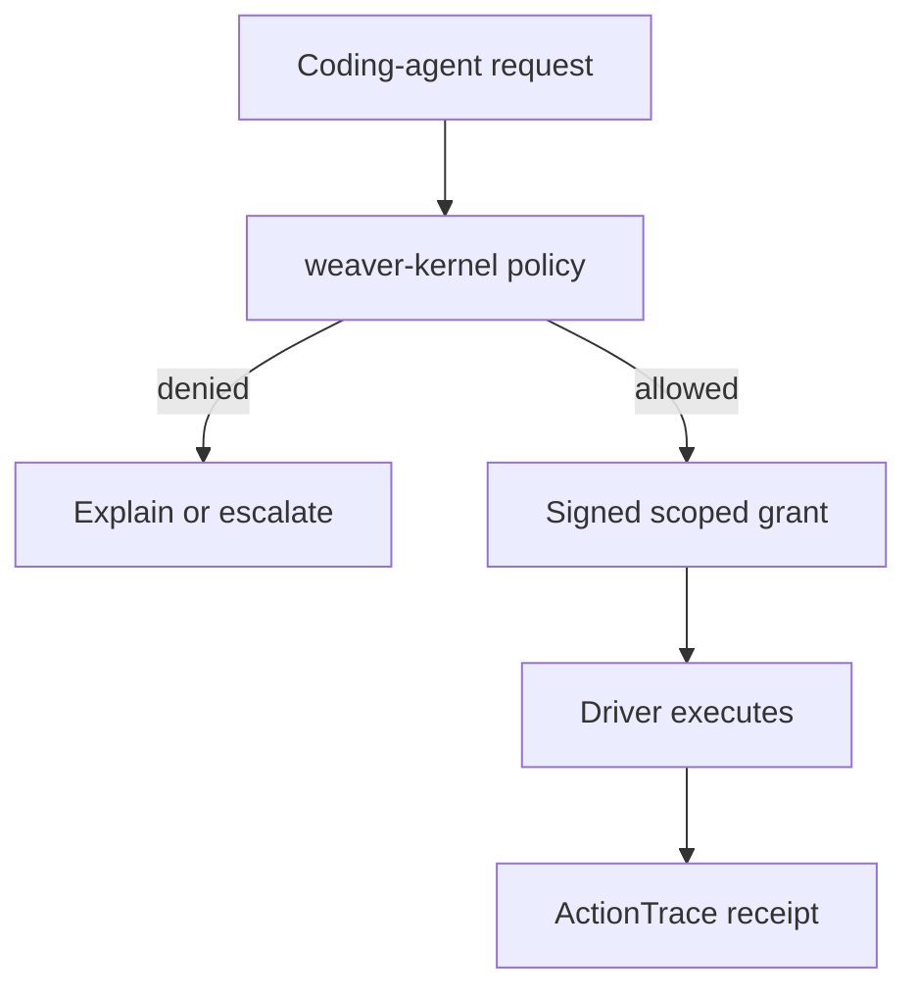
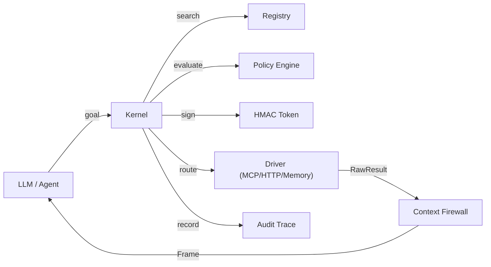

# agent-kernel

[](https://github.com/dgenio/agent-kernel/actions/workflows/ci.yml)
[](https://github.com/dgenio/agent-kernel/actions/workflows/codeql.yml)
[](https://github.com/dgenio/agent-kernel/actions/workflows/ci.yml)
[](https://www.python.org/)
[](LICENSE)
[](https://pub.towardsai.net/the-weaver-stack-one-contract-layer-for-safe-llm-agents-7f733cad5eac)

<!-- The coverage badge shows the CI-enforced floor (cov_fail_under in
pyproject.toml). The live figure (well above the floor) prints in every CI run
and is uploaded as the `coverage-html-*` artifact. -->


**Least-privilege, revocable, principal-scoped authorization for agent tool calls — with a tamper-evident audit of everything that ran.**

A capability-based security kernel for AI agents operating in large tool ecosystems (MCP, A2A, 1000+ tools).

## Least privilege for coding agents

Give an agent enough authority to read a repository, edit bounded paths, and
run tests—without also granting secrets, workflow rewrites, network/package
operations, or publishing authority.


```mermaid
flowchart TD
    A["Coding-agent request"] --> K["weaver-kernel policy"]
    K -->|denied| D["Explain or escalate"]
    K -->|allowed| T["Signed scoped grant"]
    T --> E["Driver executes"]
    E --> R["ActionTrace receipt"]
```

> **Availability:** the direct module command ships in the first package
> release containing [#253](https://github.com/dgenio/agent-kernel/issues/253).

```bash
python -m pip install weaver-kernel
python -m weaver_kernel.coding_agent_demo
```

It runs a hermetic fake driver, prints only after all assertions pass, and visibly proves bounded
read/edit/test, denied secret and out-of-scope access, explicit task-bound PR
escalation, signed scope enforcement, and the corresponding `kernel.explain()`
path. [Read the expected receipt and security boundaries.](docs/coding-agent-security.md)

| Project | Use it for |
| --- | --- |
| **agent-kernel / `weaver-kernel`** | embedded capability authorization and audit |
| [AgentFence](https://github.com/dgenio/AgentFence) | an external firewall at the tool boundary |
| [ContextWeaver](https://github.com/dgenio/contextweaver) | bounded capability/context visibility |
| ChainWeaver | deterministic multi-step execution |

Every tool call gets a **capability token** (HMAC-signed, time-bounded, scoped to one principal and one capability) and a **tamper-evident audit trace** (`ActionTrace`) recording who invoked what, under which policy decision, with what result. That **authorization + audit** layer is `agent-kernel`'s unique contribution to the [Weaver stack](#part-of-the-weaver-stack) — neither `contextweaver` nor `AgentFence` provides it.

### Why `agent-kernel` and not `contextweaver` or `AgentFence`?

- **`contextweaver`** decides *what context the LLM sees*. **`agent-kernel`** decides *what the agent is allowed to run, and proves what it ran.*
- **`AgentFence`** is an external proxy that gates tool calls *at the process boundary*. **`agent-kernel`** is the *in-process* runtime that mints the capability token, enforces policy, firewalls the result, and writes the audit trace — compiled into your agent host.
- They compose: author policy once and enforce it both embedded (`agent-kernel`) and at the edge (`AgentFence`); produce a `Frame` in `agent-kernel` and let `contextweaver` do budgeted selection over it. See the boundary notes below.

## 30-second pitch

Modern AI agents face three hard problems when given access to hundreds or thousands of tools:

1. **No authorization or audit** — nothing scopes what a tool call may do, and there's no record of what ran, when, and why.
2. **Tool-space interference** — agents accidentally invoke the wrong tool or escalate privileges.
3. **Context blowup** — raw tool output floods the LLM context window.

`agent-kernel` solves all three with a thin, composable layer that sits above your tool execution layer. The first two features are its **unique, non-overlapping contribution**; the last two it *also* provides, with explicit boundaries against its siblings:

- **Capability Tokens** *(unique to agent-kernel)* — HMAC-signed, time-bounded, principal-scoped. No token → no execution.
- **Audit Trail** *(unique to agent-kernel)* — every invocation creates an `ActionTrace` retrievable via `kernel.explain()`.
- **Policy Engine** *(boundary vs AgentFence)* — READ/WRITE/DESTRUCTIVE safety classes + PII/PCI sensitivity handling, enforced **in-process**. `AgentFence` enforces an equivalent gate at the **external boundary**; the goal is to author one policy and enforce it both places (shared-policy contract — [#111](https://github.com/dgenio/agent-kernel/issues/111)).
- **Context Firewall** *(boundary vs contextweaver)* — raw driver output is *never* returned to the LLM; always a bounded `Frame`. `agent-kernel` is the **producer** of the canonical `Frame` at the execution boundary; `contextweaver` is a **consumer** that does budgeted selection over Frames — deliberate layering, not redundancy (canonical-`Frame` seam — [#110](https://github.com/dgenio/agent-kernel/issues/110)).

## Architecture


```mermaid
graph LR
    LLM["LLM / Agent"] -->|goal| K["Kernel"]
    K -->|search| REG["Registry"]
    K -->|evaluate| POL["Policy Engine"]
    K -->|sign| TOK["HMAC Token"]
    K -->|route| DRV["Driver (MCP/HTTP/Memory)"]
    DRV -->|RawResult| FW["Context Firewall"]
    FW -->|Frame| LLM
    K -->|record| AUD["Audit Trace"]
```

## Part of the Weaver Stack

`agent-kernel` is the **execution / authorization runtime** of the **Weaver
stack** — a set of composable, independently usable projects for building safe
LLM-agent systems. On the request path:

```
contextweaver  ─►  ChainWeaver   ─►  agent-kernel        ─►  AgentFence
(select &          (deterministic     (capability tokens,     (external policy
 compile context)   tool chains)        policy, firewall,       gate at the edge)
                                         tamper-evident audit)
```

| Project | Role in the stack |
|---|---|
| [contextweaver](https://github.com/dgenio/contextweaver) | Selects and compiles the context the LLM sees. |
| ChainWeaver | Orchestrates deterministic multi-step tool chains. |
| **agent-kernel** *(this repo)* | Authorizes, executes, firewalls, and audits tool calls in-process. |
| [AgentFence](https://github.com/dgenio/AgentFence) | Enforces a policy gate at the external process boundary. |
| [weaver-spec](https://github.com/dgenio/weaver-spec) | The shared contracts (invariants; capability/token/`Frame`/policy) the others conform to. |

**Standalone by design.** `agent-kernel` has no hard dependency on any sibling
project — its only runtime dependencies are `httpx` and `pydantic`. Use it on
its own, or compose it with the rest of the stack; the siblings interoperate
through the shared [weaver-spec](https://github.com/dgenio/weaver-spec)
contracts, not through tight coupling. A deeper, per-project comparison —
including *when not* to reach for `agent-kernel` — is in
[How this relates to neighboring projects](#how-this-relates-to-neighboring-projects).

The minimal-install guarantee is enforced in CI: a dedicated job installs the
package with **no extras** (`pip install weaver-kernel`), imports the entire
public API, and runs the quickstart — so an accidental hard dependency on an
optional extra (`mcp`, `yaml`, `opentelemetry`, `tiktoken`) fails the build.

**Supply-chain & security automation.** CI runs [`pip-audit`](https://pypi.org/project/pip-audit/)
over the runtime dependency tree and [CodeQL](https://codeql.github.com/)
(`security-and-quality`) on every PR and weekly; Dependabot keeps pinned
GitHub Actions and Python dependencies fresh. Releases carry a CycloneDX SBOM
and PEP 740 PyPI attestations (see [RELEASE.md](RELEASE.md)). A `pip-audit`
false positive can be allow-listed with `pip-audit --ignore-vuln <ID>` plus a
justifying comment in the workflow.

## Quickstart

```bash
pip install weaver-kernel
```

```python
import weaver_kernel
```

> ### 📦 Repo ↔ package ↔ import — read this once
>
> | Where you see it | Name |
> |---|---|
> | GitHub repository | `dgenio/agent-kernel` |
> | PyPI — what you `pip install` | **`weaver-kernel`** |
> | Python — what you `import` | **`weaver_kernel`** |
>
> **Decision (2026-06):** the install name and the import name are unified on
> **`weaver-kernel` / `weaver_kernel`** — the two names you actually type. There
> is **no `agent_kernel` import any more**; use `weaver_kernel`. The GitHub repo
> keeps its historical `agent-kernel` slug for now (GitHub redirects old URLs);
> the package is part of the [**Weaver stack**](#part-of-the-weaver-stack), which
> is why the distribution is `weaver-`prefixed. See
> [docs/architecture.md](docs/architecture.md#naming) for the full rationale.

> **New here?** [docs/tutorial.md](docs/tutorial.md) walks through register → grant → invoke → expand → explain in five minutes.

```python
import asyncio, os
os.environ["WEAVER_KERNEL_SECRET"] = "my-secret"

from weaver_kernel import (
    Capability, CapabilityRegistry,
    InMemoryDriver, Kernel, Principal, SafetyClass, StaticRouter,
)
from weaver_kernel.models import CapabilityRequest

# 1. Register a capability
registry = CapabilityRegistry()
registry.register(Capability(
    capability_id="tasks.list",
    name="List Tasks",
    description="List all tasks",
    safety_class=SafetyClass.READ,
    tags=["tasks", "list"],
))

# 2. Wire up a driver
driver = InMemoryDriver()
driver.register_handler("tasks.list", lambda ctx: [{"id": 1, "title": "Buy milk"}])

# 3. Build the kernel
kernel = Kernel(registry=registry, router=StaticRouter(routes={"tasks.list": ["memory"]}))
kernel.register_driver(driver)

async def main():
    principal = Principal(principal_id="alice", roles=["reader"])

    # 4. Discover → grant → invoke → expand → explain
    token = kernel.get_token(
        CapabilityRequest(capability_id="tasks.list", goal="list tasks"),
        principal, justification="",
    )
    frame = await kernel.invoke(token, principal=principal, args={})
    print(frame.facts)           # ['Total rows: 1', 'Top keys: id, title', ...]
    print(frame.handle)          # Handle(handle_id='...', ...)

    # `principal` is required: the handle is bound to the granting principal,
    # so an omitted principal raises HandleConstraintViolation.
    expanded = kernel.expand(
        frame.handle, query={"limit": 1, "fields": ["title"]}, principal=principal
    )
    print(expanded.table_preview)  # [{'title': 'Buy milk'}]

    trace = kernel.explain(frame.action_id)
    print(trace.driver_id)       # 'memory'

asyncio.run(main())
```

> This snippet is extracted and executed by CI (`tests/test_readme_quickstart.py`), and
> a standalone runnable mirror lives at
> [`examples/readme_quickstart.py`](examples/readme_quickstart.py) (run by `make example`).
> CI fails if either stops producing the documented output, so this quickstart cannot
> silently drift from the working API.

## Where it fits

```
┌─────────────────────────────────────────────┐
│             LLM / Agent loop                │
├─────────────────────────────────────────────┤
│  agent-kernel  ← you are here               │
│  (registry · policy · tokens · firewall)    │
├────────────────┬────────────────────────────┤
│  contextweaver │  tool execution layer       │
│  (context      │  (MCP · HTTP · A2A ·        │
│   compilation) │   internal APIs)            │
└────────────────┴────────────────────────────┘
```

`agent-kernel` sits **above** `contextweaver` (context compilation) and **above** raw tool execution. It provides the authorization, execution, and audit layer.

## How this relates to neighboring projects

`agent-kernel` is the embeddable runtime layer of the **Weaver ecosystem**. The
projects below solve adjacent problems and are designed to compose, not to
overlap.

| Project | Role | Where it runs | Use it when… |
|---|---|---|---|
| **agent-kernel** *(this repo)* | Embeddable library/runtime: capability registry, policy, HMAC tokens, context firewall, audit trace. | In-process inside your agent host. | You need authorization, redaction, and audit between an LLM loop and a large tool ecosystem. |
| [**AgentFence**](https://github.com/dgenio/AgentFence) | External CLI / local proxy that intercepts tool calls and applies a policy gate. | Out-of-process, alongside your agent. | You want a policy boundary without changing your agent code, or you need to gate a third-party agent host you can't modify. |
| [**contextweaver**](https://github.com/dgenio/contextweaver) | Library that selects and compiles the context an LLM receives. | In-process, before the LLM call. | You need to assemble relevant context for a prompt. It sits *under* the LLM loop; agent-kernel sits *between* the LLM and tools. |
| **ChainWeaver** | Orchestrator for deterministic tool chains. | In-process or as a separate service. | You need to run a multi-step deterministic flow rather than free-form LLM tool use. |
| [**weaver-spec**](https://github.com/dgenio/weaver-spec) | Specification: invariants, capability/token/frame contracts, conformance suite. | Not a runtime — it's docs + a contract test suite. | You're building another Weaver-compatible implementation, or you want to verify an existing one. |

A minimal architecture using `agent-kernel` as the central runtime:

```
LLM / agent loop
       │
       ▼
contextweaver  ─►  agent-kernel  ─►  driver  ─►  MCP / HTTP / A2A / internal API
                       │
                       ▼
                  ActionTrace
```

### When *not* to use this

- You only need a process-level policy gate around an existing agent host —
  reach for `AgentFence` instead.
- You only need to compile context for a prompt — use `contextweaver`.
- You want a deterministic, scripted workflow with no LLM in the inner loop —
  use `ChainWeaver`.
- You're writing a static analyzer or one-shot CLI scanner with no
  per-invocation runtime — `agent-kernel` would be overkill.

See [docs/tutorial.md](docs/tutorial.md) for an end-to-end "secure your first
MCP tool in 5 minutes" walkthrough.

## Weaver Spec Compatibility: v0.1.0

agent-kernel is a compliant implementation of [weaver-spec v0.1.0](https://github.com/dgenio/weaver-spec).
The following invariants are satisfied:

| Invariant | Description | How agent-kernel satisfies it |
|-----------|-------------|-------------------------------|
| **I-01** | LLM never sees raw tool output by default | `Context Firewall` always transforms `RawResult → Frame`; raw driver output is not returned by default, and non-admin principals cannot obtain `raw` response mode |
| **I-02** | Every execution is authorized and auditable | `PolicyEngine` authorizes at grant time; a valid `CapabilityToken` (HMAC-verified on every `invoke()`) carries the authorization decision; `TraceStore` records every `ActionTrace` |
| **I-06** | CapabilityTokens are scoped | Tokens bind `principal_id + capability_id + constraints` with an explicit TTL; `revoke(token_id)` / `revoke_all(principal_id)` are supported |

See [docs/agent-context/invariants.md](docs/agent-context/invariants.md) for the full internal invariant list and [weaver-spec INVARIANTS.md](https://github.com/dgenio/weaver-spec/blob/main/docs/INVARIANTS.md) for the specification.

## Security disclaimers

> **v0.1 is not production-hardened for real authentication.**

- HMAC tokens are tamper-evident (SHA-256) but **not encrypted**. Do not put sensitive data in token fields.
- Set `WEAVER_KERNEL_SECRET` to a strong random value in production. If unset, a random dev secret is generated per-process with a warning.
- PII redaction is heuristic (regex). It is not a substitute for proper data governance.
- See [docs/security.md](docs/security.md) for the full threat model.

## Documentation

- [Architecture](docs/architecture.md)
- [Security model](docs/security.md)
- [Integrations (MCP, HTTPDriver)](docs/integrations.md)
  - [contextweaver: policy before action](docs/integrations/contextweaver.md)
  - [Repository safety checks as a capability](docs/integrations/repository_safety_check.md)
  - [ChainWeaver compiled flows as capabilities](docs/integrations/chainweaver.md)
  - [Policy guardrails for evaluation artifacts](docs/integrations/evaluation_artifacts.md)
- [Designing capabilities](docs/capabilities.md)
- [Context Firewall](docs/context_firewall.md)

## Development

```bash
git clone https://github.com/dgenio/agent-kernel
cd agent-kernel
pip install -e ".[dev]"
make ci      # fmt-check + lint + type + test + examples
```

## License

Apache-2.0 — see [LICENSE](LICENSE).

