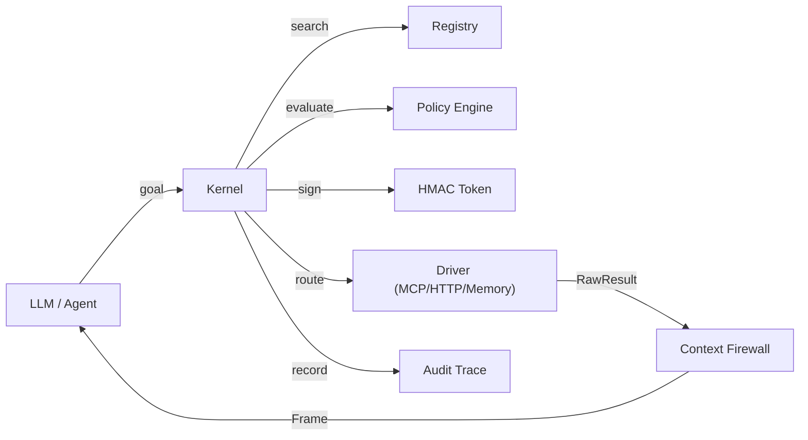

# agent-kernel

[](https://github.com/dgenio/agent-kernel/actions/workflows/ci.yml)
[](https://www.python.org/)
[](LICENSE)

A capability-based security kernel for AI agents operating in large tool ecosystems (MCP, A2A, 1000+ tools).

## 30-second pitch

Modern AI agents face three hard problems when given access to hundreds or thousands of tools:

1. **Context blowup** — raw tool output floods the LLM context window.
2. **Tool-space interference** — agents accidentally invoke the wrong tool or escalate privileges.
3. **No audit trail** — there's no record of what ran, when, and why.

`agent-kernel` solves all three with a thin, composable layer that sits above your tool execution layer:

- **Capability Tokens** — HMAC-signed, time-bounded, principal-scoped. No token → no execution.
- **Policy Engine** — READ/WRITE/DESTRUCTIVE safety classes + PII/PCI sensitivity handling.
- **Context Firewall** — raw driver output is *never* returned to the LLM; always a bounded `Frame`.
- **Audit Trail** — every invocation creates an `ActionTrace` retrievable via `kernel.explain()`.

## Architecture


```mermaid
graph LR
    LLM["LLM / Agent"] -->|goal| K["Kernel"]
    K -->|search| REG["Registry"]
    K -->|evaluate| POL["Policy Engine"]
    K -->|sign| TOK["HMAC Token"]
    K -->|route| DRV["Driver (MCP/HTTP/Memory)"]
    DRV -->|RawResult| FW["Context Firewall"]
    FW -->|Frame| LLM
    K -->|record| AUD["Audit Trace"]
```

## Quickstart

```bash
pip install weaver-kernel
```

> **Note:** The PyPI package is `weaver-kernel` (Weaver ecosystem), but the Python import remains `weaver_kernel`.

> **New here?** [docs/tutorial.md](docs/tutorial.md) walks through register → grant → invoke → expand → explain in five minutes.

```python
import asyncio, os
os.environ["WEAVER_KERNEL_SECRET"] = "my-secret"

from weaver_kernel import (
    Capability, CapabilityRegistry,
    InMemoryDriver, Kernel, Principal, SafetyClass, StaticRouter,
)
from weaver_kernel.models import CapabilityRequest

# 1. Register a capability
registry = CapabilityRegistry()
registry.register(Capability(
    capability_id="tasks.list",
    name="List Tasks",
    description="List all tasks",
    safety_class=SafetyClass.READ,
    tags=["tasks", "list"],
))

# 2. Wire up a driver
driver = InMemoryDriver()
driver.register_handler("tasks.list", lambda ctx: [{"id": 1, "title": "Buy milk"}])

# 3. Build the kernel
kernel = Kernel(registry=registry, router=StaticRouter(routes={"tasks.list": ["memory"]}))
kernel.register_driver(driver)

async def main():
    principal = Principal(principal_id="alice", roles=["reader"])

    # 4. Discover → grant → invoke → expand → explain
    token = kernel.get_token(
        CapabilityRequest(capability_id="tasks.list", goal="list tasks"),
        principal, justification="",
    )
    frame = await kernel.invoke(token, principal=principal, args={})
    print(frame.facts)           # ['Total rows: 1', 'Top keys: id, title', ...]
    print(frame.handle)          # Handle(handle_id='...', ...)

    # `principal` is required: the handle is bound to the granting principal,
    # so an omitted principal raises HandleConstraintViolation.
    expanded = kernel.expand(
        frame.handle, query={"limit": 1, "fields": ["title"]}, principal=principal
    )
    print(expanded.table_preview)  # [{'title': 'Buy milk'}]

    trace = kernel.explain(frame.action_id)
    print(trace.driver_id)       # 'memory'

asyncio.run(main())
```

> This snippet is extracted and executed by CI (`tests/test_readme_quickstart.py`), and
> a standalone runnable mirror lives at
> [`examples/readme_quickstart.py`](examples/readme_quickstart.py) (run by `make example`).
> CI fails if either stops producing the documented output, so this quickstart cannot
> silently drift from the working API.

## Where it fits

```
┌─────────────────────────────────────────────┐
│             LLM / Agent loop                │
├─────────────────────────────────────────────┤
│  agent-kernel  ← you are here               │
│  (registry · policy · tokens · firewall)    │
├────────────────┬────────────────────────────┤
│  contextweaver │  tool execution layer       │
│  (context      │  (MCP · HTTP · A2A ·        │
│   compilation) │   internal APIs)            │
└────────────────┴────────────────────────────┘
```

`agent-kernel` sits **above** `contextweaver` (context compilation) and **above** raw tool execution. It provides the authorization, execution, and audit layer.

## How this relates to neighboring projects

`agent-kernel` is the embeddable runtime layer of the **Weaver ecosystem**. The
projects below solve adjacent problems and are designed to compose, not to
overlap.

| Project | Role | Where it runs | Use it when… |
|---|---|---|---|
| **agent-kernel** *(this repo)* | Embeddable library/runtime: capability registry, policy, HMAC tokens, context firewall, audit trace. | In-process inside your agent host. | You need authorization, redaction, and audit between an LLM loop and a large tool ecosystem. |
| [**AgentFence**](https://github.com/dgenio/AgentFence) | External CLI / local proxy that intercepts tool calls and applies a policy gate. | Out-of-process, alongside your agent. | You want a policy boundary without changing your agent code, or you need to gate a third-party agent host you can't modify. |
| [**contextweaver**](https://github.com/dgenio/contextweaver) | Library that selects and compiles the context an LLM receives. | In-process, before the LLM call. | You need to assemble relevant context for a prompt. It sits *under* the LLM loop; agent-kernel sits *between* the LLM and tools. |
| **ChainWeaver** | Orchestrator for deterministic tool chains. | In-process or as a separate service. | You need to run a multi-step deterministic flow rather than free-form LLM tool use. |
| [**weaver-spec**](https://github.com/dgenio/weaver-spec) | Specification: invariants, capability/token/frame contracts, conformance suite. | Not a runtime — it's docs + a contract test suite. | You're building another Weaver-compatible implementation, or you want to verify an existing one. |

A minimal architecture using `agent-kernel` as the central runtime:

```
LLM / agent loop
       │
       ▼
contextweaver  ─►  agent-kernel  ─►  driver  ─►  MCP / HTTP / A2A / internal API
                       │
                       ▼
                  ActionTrace
```

### When *not* to use this

- You only need a process-level policy gate around an existing agent host —
  reach for `AgentFence` instead.
- You only need to compile context for a prompt — use `contextweaver`.
- You want a deterministic, scripted workflow with no LLM in the inner loop —
  use `ChainWeaver`.
- You're writing a static analyzer or one-shot CLI scanner with no
  per-invocation runtime — `agent-kernel` would be overkill.

See [docs/tutorial.md](docs/tutorial.md) for an end-to-end "secure your first
MCP tool in 5 minutes" walkthrough.

## Weaver Spec Compatibility: v0.1.0

agent-kernel is a compliant implementation of [weaver-spec v0.1.0](https://github.com/dgenio/weaver-spec).
The following invariants are satisfied:

| Invariant | Description | How agent-kernel satisfies it |
|-----------|-------------|-------------------------------|
| **I-01** | LLM never sees raw tool output by default | `Context Firewall` always transforms `RawResult → Frame`; raw driver output is not returned by default, and non-admin principals cannot obtain `raw` response mode |
| **I-02** | Every execution is authorized and auditable | `PolicyEngine` authorizes at grant time; a valid `CapabilityToken` (HMAC-verified on every `invoke()`) carries the authorization decision; `TraceStore` records every `ActionTrace` |
| **I-06** | CapabilityTokens are scoped | Tokens bind `principal_id + capability_id + constraints` with an explicit TTL; `revoke(token_id)` / `revoke_all(principal_id)` are supported |

See [docs/agent-context/invariants.md](docs/agent-context/invariants.md) for the full internal invariant list and [weaver-spec INVARIANTS.md](https://github.com/dgenio/weaver-spec/blob/main/docs/INVARIANTS.md) for the specification.

## Security disclaimers

> **v0.1 is not production-hardened for real authentication.**

- HMAC tokens are tamper-evident (SHA-256) but **not encrypted**. Do not put sensitive data in token fields.
- Set `WEAVER_KERNEL_SECRET` to a strong random value in production. If unset, a random dev secret is generated per-process with a warning.
- PII redaction is heuristic (regex). It is not a substitute for proper data governance.
- See [docs/security.md](docs/security.md) for the full threat model.

## Documentation

- [Architecture](docs/architecture.md)
- [Security model](docs/security.md)
- [Integrations (MCP, HTTPDriver)](docs/integrations.md)
  - [contextweaver: policy before action](docs/integrations/contextweaver.md)
  - [Repository safety checks as a capability](docs/integrations/repository_safety_check.md)
  - [ChainWeaver compiled flows as capabilities](docs/integrations/chainweaver.md)
  - [Policy guardrails for evaluation artifacts](docs/integrations/evaluation_artifacts.md)
- [Designing capabilities](docs/capabilities.md)
- [Context Firewall](docs/context_firewall.md)

## Development

```bash
git clone https://github.com/dgenio/agent-kernel
cd agent-kernel
pip install -e ".[dev]"
make ci      # fmt-check + lint + type + test + examples
```

## License

Apache-2.0 — see [LICENSE](LICENSE).

