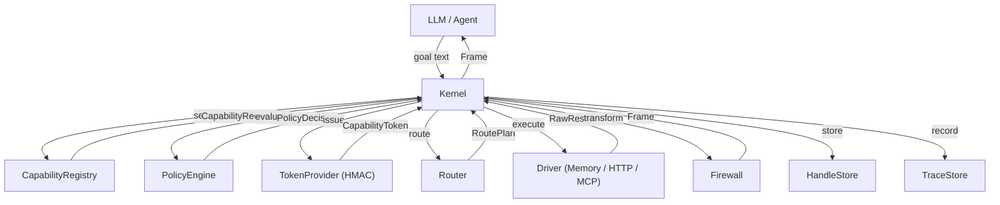

# Architecture

## Overview

`agent-kernel` is a capability-based security kernel that sits **above** raw tool execution (MCP, HTTP APIs, internal services) and **below** the LLM context window.

## Components

### Kernel
The central orchestrator. Wires all components together and exposes five methods:
- `request_capabilities(goal)` — discover relevant capabilities
- `grant_capability(request, principal, justification)` — policy check + token issuance
- `invoke(token, principal, args, response_mode)` — execute + firewall + trace
- `expand(handle, query)` — paginate/filter stored results
- `explain(action_id)` — retrieve audit trace

### CapabilityRegistry
A flat dict of `Capability` objects indexed by `capability_id`. Provides keyword-based search (no LLM, no vector DB — purely token overlap scoring).

### PolicyEngine
The `DefaultPolicyEngine` implements role-based rules:
1. **READ** — always allowed
2. **WRITE** — requires `justification ≥ 15 chars` + role `writer|admin`
3. **DESTRUCTIVE** — requires role `admin`
4. **PII/PCI** — requires `tenant` attribute; enforces `allowed_fields` unless `pii_reader`
5. **max_rows** — 50 (user), 500 (service)

### TokenProvider (HMAC)
Issues HMAC-SHA256 signed tokens. Each token is bound to `principal_id + capability_id + constraints`. Verification checks: expiry → signature → principal → capability.

### Router
`StaticRouter` maps `capability_id → [driver_id, ...]`. First driver that succeeds wins; others are tried as fallbacks.

### Drivers
- **InMemoryDriver** — Python callables, used for tests and demos
- **HTTPDriver** — `httpx`-based async HTTP client
- (Future) **MCPDriver** — adapter for Model Context Protocol tool servers

### Firewall
Transforms `RawResult → Frame`. Never exposes raw output to the LLM.
- Four response modes: `summary`, `table`, `handle_only`, `raw`
- Enforces `Budgets` (max_rows, max_fields, max_chars, max_depth)
- Redacts sensitive fields and inline PII patterns
- Deterministic summarisation (no LLM)

### HandleStore
Stores full results by opaque handle ID with TTL. `expand()` supports pagination, field selection, and basic equality filtering.

### TraceStore
Records every `ActionTrace`. `explain(action_id)` returns the full audit record.
