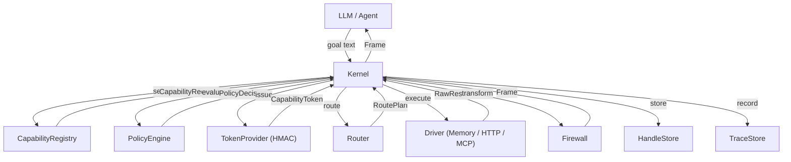

# Architecture

## Overview

`agent-kernel` is a capability-based security kernel that sits **above** raw tool execution (MCP, HTTP APIs, internal services) and **below** the LLM context window.

```mermaid
graph TD
    LLM["LLM / Agent"] -->|goal text| K["Kernel"]
    K -->|search| REG["CapabilityRegistry"]
    REG -->|CapabilityRequest| K
    K -->|evaluate| POL["PolicyEngine"]
    POL -->|PolicyDecision| K
    K -->|issue| TOK["TokenProvider (HMAC)"]
    TOK -->|CapabilityToken| K
    K -->|route| ROU["Router"]
    ROU -->|RoutePlan| K
    K -->|execute| DRV["Driver (Memory / HTTP / MCP)"]
    DRV -->|RawResult| K
    K -->|transform| FW["Firewall"]
    FW -->|Frame| K
    K -->|store| HS["HandleStore"]
    K -->|record| TS["TraceStore"]
    K -->|Frame| LLM
```

## Components

### Kernel
The central orchestrator. Wires all components together and exposes:
- `request_capabilities(goal)` — discover relevant capabilities
- `grant_capability(request, principal, justification)` — policy check + token issuance
- `invoke(token, principal, args, response_mode, dry_run=False)` — execute + firewall + trace, or short-circuit before driver dispatch when `dry_run=True`
- `expand(handle, query)` — paginate/filter stored results
- `explain(action_id)` — retrieve audit trace
- `explain_denial(request, principal, justification)` — return a structured `DenialExplanation` instead of raising `PolicyDenied`

### CapabilityRegistry
A flat dict of `Capability` objects indexed by `capability_id`. Provides keyword-based search (no LLM, no vector DB — purely token overlap scoring).

### PolicyEngine
Two protocols and two built-in engines:

- **`PolicyEngine`** (protocol) — single required method: `evaluate(request, capability, principal, justification) -> PolicyDecision`.
- **`ExplainingPolicyEngine`** (protocol, extends `PolicyEngine`) — adds `explain(...) -> DenialExplanation`. Only engines that implement this protocol can be used with `Kernel.explain_denial`; otherwise that call raises `AgentKernelError` with a clear message. Splitting the contract keeps existing downstream `PolicyEngine` implementers backward-compatible.

Both built-in engines satisfy `ExplainingPolicyEngine`:

- **`DefaultPolicyEngine`** — hardcoded role-based rules:
  1. **READ** — always allowed
  2. **WRITE** — requires `justification ≥ 15 chars` + role `writer|admin`
  3. **DESTRUCTIVE** — requires role `admin` + `justification ≥ 15 chars`
  4. **PII/PCI** — requires `tenant` attribute; enforces `allowed_fields` unless `pii_reader`
  5. **SECRETS** — requires role `admin|secrets_reader` + `justification ≥ 15 chars`
  6. **max_rows** — 50 (user), 500 (service)
  7. **Rate limiting** — sliding-window per `(principal_id, capability_id)` (60 READ / 10 WRITE / 2 DESTRUCTIVE per 60s; service role gets 10×)
- **`DeclarativePolicyEngine`** — loads rules from a YAML or TOML file (or a plain dict). Supports `safety_class`, `sensitivity`, `roles`, `attributes`, and `min_justification` match conditions; `allow`/`deny` actions; per-rule `constraints` merged into the resulting `PolicyDecision`; configurable `default` action. Rules are evaluated top-down with first-match-wins. `pyyaml` and `tomli` are optional dependencies — `import agent_kernel` works without them; calling `from_yaml`/`from_toml` without the parser raises `PolicyConfigError` with an install hint.

#### Denial explanations

`PolicyEngine.explain()` (when available) returns a structured `DenialExplanation` with `denied`, `rule_name`, a `failed_conditions: list[FailedCondition]` describing each missing condition with `required`/`actual`/`suggestion`, a `remediation` list, and a human-readable `narrative`. Engines collect all failing conditions (no short-circuit) so callers get the full picture. For `DeclarativePolicyEngine`, an explicit deny rule that fully matches is reported as the cause; partial-match deny rules are skipped during explanation so the surfaced advice is actionable rather than self-defeating.

#### Dry-run mode

`Kernel.invoke(dry_run=True)` verifies the token and resolves the route plan but **never calls the driver**. It returns a `DryRunResult` with the resolved `driver_id`, the same `operation` a driver would receive (`args.get("operation", capability_id)`), the request constraints, the effective `response_mode` (Firewall's admin-only gate is mirrored: non-admin `raw` is downgraded to `summary`), and a coarse `estimated_cost` tier based on `SafetyClass`. Token verification still raises `TokenExpired` / `TokenInvalid` / `TokenScopeError` in dry-run, so the mode is safe as a policy/route sanity check. See [`docs/capabilities.md`](capabilities.md#dry-run-mode) for usage and [`docs/agent-context/invariants.md`](agent-context/invariants.md) for the parity rule with the real-invoke path.

### TokenProvider (HMAC)
Issues HMAC-SHA256 signed tokens. Each token is bound to `principal_id + capability_id + constraints`. Verification checks: expiry → signature → principal → capability.

### Router
`StaticRouter` maps `capability_id → [driver_id, ...]`. First driver that succeeds wins; others are tried as fallbacks.

### Drivers
- **InMemoryDriver** — Python callables, used for tests and demos
- **HTTPDriver** — `httpx`-based async HTTP client
- (Future) **MCPDriver** — adapter for Model Context Protocol tool servers

### Firewall
Transforms `RawResult → Frame`. Never exposes raw output to the LLM.
- Four response modes: `summary`, `table`, `handle_only`, `raw`
- Enforces `Budgets` (max_rows, max_fields, max_chars, max_depth)
- Redacts sensitive fields and inline PII patterns
- Deterministic summarisation (no LLM)

### HandleStore
Stores full results by opaque handle ID with TTL. `expand()` supports pagination, field selection, and basic equality filtering.

### TraceStore
Records every `ActionTrace`. `explain(action_id)` returns the full audit record.
