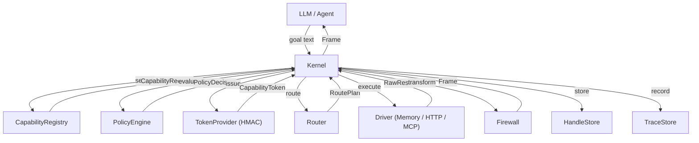

# Architecture

## Naming

This project carries three related names; they are deliberately reconciled:

| Where you see it | Name |
|---|---|
| GitHub repository | `dgenio/agent-kernel` |
| PyPI distribution (`pip install`) | `weaver-kernel` |
| Python import | `weaver_kernel` |

**Decision (2026-06):** the install name and the import name are unified on
`weaver-kernel` / `weaver_kernel` — the two strings a user actually types — so
`pip install weaver-kernel` is followed by `import weaver_kernel` with no
mismatch. There is no `agent_kernel` import any more. The `weaver-` prefix marks
membership in the [Weaver stack](../README.md#part-of-the-weaver-stack); the
GitHub repository keeps its historical `agent-kernel` slug (GitHub redirects old
URLs), which is the only remaining surface where the legacy name appears. A
repository-slug rename to `weaver-kernel` is the optional final step and can be
done in repo settings without code changes.

## Overview

`agent-kernel` is a capability-based security kernel that sits **above** raw tool execution (MCP, HTTP APIs, internal services) and **below** the LLM context window.


```mermaid
graph TD
    LLM["LLM / Agent"] -->|goal text| K["Kernel"]
    K -->|search| REG["CapabilityRegistry"]
    REG -->|CapabilityRequest| K
    K -->|evaluate| POL["PolicyEngine"]
    POL -->|PolicyDecision| K
    K -->|issue| TOK["TokenProvider (HMAC)"]
    TOK -->|CapabilityToken| K
    K -->|route| ROU["Router"]
    ROU -->|RoutePlan| K
    K -->|execute| DRV["Driver (Memory / HTTP / MCP)"]
    DRV -->|RawResult| K
    K -->|transform| FW["Firewall"]
    FW -->|Frame| K
    K -->|store| HS["HandleStore"]
    K -->|record| TS["TraceStore"]
    K -->|Frame| LLM
```

## Components

### Kernel
The central orchestrator. Wires all components together and exposes:
- `request_capabilities(goal)` — discover relevant capabilities
- `grant_capability(request, principal, justification)` — policy check + token issuance
- `invoke(token, principal, args, response_mode, dry_run=False)` — execute + firewall + trace, or short-circuit before driver dispatch when `dry_run=True`
- `expand(handle, *, query, principal=None)` — paginate/filter stored results; `principal` is required for principal-bound handles (see [`docs/security.md`](security.md#handle-expansion-boundary))
- `explain(action_id)` — retrieve audit trace
- `explain_denial(request, principal, justification)` — return a structured `DenialExplanation` instead of raising `PolicyDenied`

### CapabilityRegistry
A flat dict of `Capability` objects indexed by `capability_id`. Provides keyword-based search (no LLM, no vector DB — purely token overlap scoring).

### PolicyEngine
Two protocols and two built-in engines:

- **`PolicyEngine`** (protocol) — single required method: `evaluate(request, capability, principal, justification) -> PolicyDecision`.
- **`ExplainingPolicyEngine`** (protocol, extends `PolicyEngine`) — adds `explain(...) -> DenialExplanation`. Only engines that implement this protocol can be used with `Kernel.explain_denial`; otherwise that call raises `AgentKernelError` with a clear message. Splitting the contract keeps existing downstream `PolicyEngine` implementers backward-compatible.

Both built-in engines satisfy `ExplainingPolicyEngine`:

- **`DefaultPolicyEngine`** — hardcoded role-based rules:
  1. **READ** — always allowed
  2. **WRITE** — requires `justification ≥ 15 chars` + role `writer|admin`
  3. **DESTRUCTIVE** — requires role `admin` + `justification ≥ 15 chars`
  4. **PII/PCI** — requires `tenant` attribute; enforces `allowed_fields` unless `pii_reader`
  5. **SECRETS** — requires role `admin|secrets_reader` + `justification ≥ 15 chars`
  6. **MEMORY** — `memory.read` with `scope.memory_scope == "sensitive"` requires role `memory_reader_sensitive|admin`; `memory.write` / DESTRUCTIVE memory requires role `memory_writer|admin`. Project-scoped memory reads are allowed by default. The kernel also redacts `payload`/`content`/`value`/`memory`/`text`/`body` keys from `ActionTrace.args` for any capability whose ID starts with `memory.`
  7. **max_rows** — 50 (user), 500 (service)
  8. **Rate limiting** — sliding-window per `(principal_id, capability_id)` (60 READ / 10 WRITE / 2 DESTRUCTIVE per 60s; service role gets 10×)
- **`DeclarativePolicyEngine`** — loads rules from a YAML or TOML file (or a plain dict). Supports `safety_class`, `sensitivity`, `roles`, `attributes`, `min_justification`, `intent`, and `scope` match conditions; `allow`/`deny` actions; per-rule `constraints` merged into the resulting `PolicyDecision`; configurable `default` action. Rules are evaluated top-down with first-match-wins. `pyyaml` and `tomli` are optional dependencies — `import weaver_kernel` works without them; calling `from_yaml`/`from_toml` without the parser raises `PolicyConfigError` with an install hint.

#### Intent and scope on requests

`CapabilityRequest` carries optional structured metadata alongside its free-text `goal`:

- `intent: str | None` — a machine-readable label (e.g. `"customer_support_lookup"`).
- `scope: dict[str, Any]` — a small structured map (e.g. `{"region": "eu-west", "customer_id": "C-42"}`).

`DeclarativePolicyEngine` rules can match on these via top-level keys in `match`:

```yaml
- name: support_eu_lookup
  match:
    safety_class: [READ]
    intent: [customer_support_lookup]
    scope: { region: "eu-west" }
  action: allow
```

Intent-aware rules fail closed: a request with `intent=None` never matches a rule that requires a specific intent. `scope: { key: "*" }` means "the key must be present with any value".

#### Denial explanations

`PolicyEngine.explain()` (when available) returns a structured `DenialExplanation` with `denied`, `rule_name`, a `failed_conditions: list[FailedCondition]` describing each missing condition with `required`/`actual`/`suggestion`/`reason_code`, a `remediation` list, a human-readable `narrative`, and a top-level `reason_code` (the code of the first failed condition). Engines collect all failing conditions (no short-circuit) so callers get the full picture. For `DeclarativePolicyEngine`, an explicit deny rule that fully matches is reported as the cause; partial-match deny rules are skipped during explanation so the surfaced advice is actionable rather than self-defeating.

#### Reason codes

Every `PolicyDecision`, `DenialExplanation`, `FailedCondition`, and `PolicyDenied` from the built-in engines carries a stable `reason_code`. Assert on these codes — not on the human-readable `reason` / `narrative` strings:

| Code (`DenialReason.*`) | When |
|---|---|
| `missing_role` | Principal lacks a required role |
| `missing_tenant_attribute` | PII/PCI capability needs `tenant` attribute |
| `missing_attribute` | Declarative rule's required attribute absent or mismatched |
| `insufficient_justification` | Justification shorter than the minimum |
| `invalid_constraint` | Constraint value (e.g. `max_rows`) not parseable |
| `rate_limited` | Sliding-window rate limit exceeded |
| `no_matching_rule` | DSL: no rule matched + default `deny` |
| `explicit_deny_rule` | DSL: a `deny` rule matched fully |
| `intent_not_allowed` | DSL: `match.intent` rejected the request's intent |
| `scope_not_allowed` | DSL: `match.scope` rejected the request's scope |
| `handle_constraint_violation` | `HandleStore.expand` request exceeded grant's `max_rows`, `allowed_fields`, or `scope` (#76) |
| `handle_principal_mismatch` | Handle expansion attempted by a different principal than the one the original grant was issued to (#76) |
| `memory_write_requires_writer` | `SensitivityTag.MEMORY` WRITE/DESTRUCTIVE without `memory_writer` or `admin` role (#75) |
| `memory_sensitive_read_denied` | `SensitivityTag.MEMORY` read with `scope.memory_scope == "sensitive"` without `memory_reader_sensitive` or `admin` role (#75) |

Allow-side codes (`AllowReason.*`): `default_policy_allow`, `rule_allow`, `default_fallthrough_allow`, `token_verified`.

#### Decision trace

Every `PolicyDecision` from a built-in engine carries a `PolicyDecisionTrace` describing how the decision was reached: the engine name, the capability and principal IDs, the request's `intent` (echoed) and `scope_keys` (scope dimension names only — values are redacted), and an ordered list of `PolicyTraceStep` entries. Each step records the rule name, the outcome (`matched`/`skipped`/`denied`/`allowed`/`constraint_applied`), a human-readable detail, and — for terminal steps — the same stable `reason_code` carried on the decision. Traces are safe to log and serialize: they contain rule names, condition names, and codes only — never raw argument values.

#### Dry-run mode

`Kernel.invoke(dry_run=True)` verifies the token and resolves the route plan but **never calls the driver**. It returns a `DryRunResult` with the resolved `driver_id`, the same `operation` a driver would receive (`args.get("operation", capability_id)`), the request constraints, the effective `response_mode` (Firewall's admin-only gate is mirrored: non-admin `raw` is downgraded to `summary`), and a coarse `estimated_cost` tier based on `SafetyClass`. Token verification still raises `TokenExpired` / `TokenInvalid` / `TokenScopeError` in dry-run, so the mode is safe as a policy/route sanity check. See [`docs/capabilities.md`](capabilities.md#dry-run-mode) for usage and [`docs/agent-context/invariants.md`](agent-context/invariants.md) for the parity rule with the real-invoke path.

### TokenProvider (HMAC)
Issues HMAC-SHA256 signed tokens. Each token is bound to `principal_id + capability_id + constraints`. Verification checks: expiry → signature → principal → capability.

### Router
`StaticRouter` maps `capability_id → [driver_id, ...]`. First driver that succeeds wins; others are tried as fallbacks.

### Drivers
- **InMemoryDriver** — Python callables, used for tests and demos
- **HTTPDriver** — `httpx`-based async HTTP client
- (Future) **MCPDriver** — adapter for Model Context Protocol tool servers

### Firewall
Transforms `RawResult → Frame`. Never exposes raw output to the LLM.
- Four response modes: `summary`, `table`, `handle_only`, `raw`
- Enforces `Budgets` (max_rows, max_fields, max_chars, max_depth)
- Redacts sensitive fields and inline PII patterns
- Deterministic summarisation (no LLM)

### HandleStore
Stores full results by opaque handle ID with TTL. `expand()` supports pagination, field selection, and basic equality filtering.

### TraceStore
Records every `ActionTrace`. `explain(action_id)` returns the full audit record. On a successful invocation the trace also carries a `result_summary` — a redaction-safe dict of counts/flags (`fact_count`, `row_count`, `warning_count`, `has_handle`) derived from the firewalled `Frame`, never from raw driver data — so an invocation's outcome is auditable directly (e.g. a repository safety check passed iff `result_summary["row_count"] == 0`). Failed runs have `result_summary == None`. Each trace also records the invoked capability's `sensitivity` (`NONE`/`PII`/`PCI`/`SECRETS`/`MEMORY`).

`export_action_trace` / `export_action_traces` serialise traces into a stable, versioned, JSON-serialisable shape for downstream analysis tools (distinct from the OpenTelemetry observability export); `Kernel.list_traces()` is the public accessor that feeds them the audit trail. See [trace_export.md](trace_export.md).

#### Audited event types (#175)

`ActionTrace.event_type` distinguishes three kinds of audited event, so the
audit trail covers authorization decisions and data-access events, not only
successful invocations (I-02):

| `event_type` | Recorded when | Notable fields |
|--------------|---------------|----------------|
| `invoke` (default) | A capability invocation runs | `driver_id`, `result_summary`, `handle_id` |
| `expand` | `Kernel.expand()` serves more rows of a handle | `handle_id`, `result_summary`; expansion Frames carry `Provenance.principal_id` |
| `deny` | A `grant_capability()` call is rejected by policy | `reason_code` (stable `DenialReason`), redacted `error`; no token is issued |

`reason_code` is populated for `deny` events. All three fields are additive with
defaults, so a directly-constructed trace keeps the original `invoke` meaning.

#### Querying the audit trail (#177)

`Kernel.query_traces(TraceQuery(...))` (and `TraceStore.query(...)` on any
backend) filters records by `principal_id`, `capability_id`, `event_type`,
`outcome` (`succeeded`/`failed`), `reason_code`, and a `since`/`until` window
(`since` inclusive, `until` exclusive), with `limit`/`offset` pagination. Results
are ordered deterministically by `(invoked_at, action_id)`, so successive pages
over an unchanged store are disjoint and complete. The pure `query_traces()`
function applies the same semantics to any iterable of traces.

#### Bounded memory (#182)

The in-memory `TraceStore` caps itself at `max_entries` (default 10 000) and
evicts oldest-first when exceeded; eviction is *loud* (first eviction logs a
warning) and observable via `TraceStore.evicted_count`. Re-recording an existing
`action_id` overwrites in place and never evicts. Deployments needing unbounded
retention should use a durable backend. Revocation state is bounded similarly —
see [Persistence & durable stores](#persistence--durable-stores) and
[security.md](security.md).

#### Kernel metrics counters (#179)

`Kernel.stats` returns an immutable `StatsSnapshot` of aggregate counters
(grants, denials by reason code, invocations, invocation failures, fallback
activations, redaction events, budget downgrades, handle stores, expansions);
`Kernel.reset_stats()` zeroes them. The counters are dependency-free and
lock-guarded — cheap health-check telemetry that needs neither a trace export nor
the `otel` extra. They are *aggregates*; the `TraceStore` remains the record of
individual events.

## Persistence & durable stores

The stateful stores are protocol-based seams (`weaver_kernel.stores`), mirroring
the `Driver` / `PolicyEngine` pattern. The in-memory implementations are the
defaults; durable backends are opt-in via constructor injection.

| Protocol | Default (in-memory) | Durable backends | Injected via |
|----------|--------------------|------------------|--------------|
| `TraceStoreProtocol` | `TraceStore` | `SQLiteTraceStore`, `JsonlTraceStore` | `Kernel(trace_store=...)` |
| `RevocationStoreProtocol` | `InMemoryRevocationStore` | `SQLiteRevocationStore` | `HMACTokenProvider(revocation_store=...)` |
| `HandleStoreProtocol` | `HandleStore` | *(none yet — see below)* | `Kernel(handle_store=...)` |

```python
from weaver_kernel import Kernel, HMACTokenProvider
from weaver_kernel.stores import SQLiteTraceStore, SQLiteRevocationStore

kernel = Kernel(
    registry,
    token_provider=HMACTokenProvider(revocation_store=SQLiteRevocationStore("revoked.db")),
    trace_store=SQLiteTraceStore("audit.db"),
)
```

**Backend selection.** Use the in-memory defaults for ephemeral or single-process
use. Use `SQLiteTraceStore` for a durable, queryable, hash-chained audit trail
that survives restarts and supports retention pruning; use `JsonlTraceStore` for
an append-only log that is easy to ship to a collector. Use
`SQLiteRevocationStore` when `revoke()` / `revoke_all()` must outlive a process
or apply across workers sharing a database file. All durable backends use only
the standard library (`sqlite3`, `json`) — no new runtime dependency.

**Bounded revocation state (#182).** Every revocation backend tracks each
token's `expires_at` and can `sweep_expired(now)` to drop bookkeeping for tokens
that have already expired — they fail the verifier's expiry check regardless, so
a sweep never un-revokes a *live* token. The in-memory store sweeps lazily on an
interval; `HMACTokenProvider.sweep_revocations()` triggers it explicitly (call it
on a schedule for durable backends). `RevocationStoreProtocol.track()` therefore
takes an `expires_at` argument and the protocol includes `sweep_expired()`.

**Verifiable audit chain.** Persisted traces are hash-chained
(`prev_hash`/`record_hash`, HMAC-SHA256 keyed by `WEAVER_KERNEL_SECRET`).
`verify_chain()` detects mutation, insertion, deletion, and reordering;
`SQLiteTraceStore.prune(before=...)` enforces retention while keeping the
retained suffix verifiable via a checkpoint. The integrity model and its limits
are documented in [security.md](security.md#audit-log-integrity-hash-chain).

**Handle persistence is intentionally not shipped yet.** `HandleStoreProtocol` is
defined so a durable backend can be added without a breaking change, but handles
are short-lived, TTL-bounded result caches whose durability matters far less than
the audit trail's; only the in-memory `HandleStore` ships today.

### Adapters (`weaver_kernel.adapters`)
Vendor-specific tool-format adapters that translate between `Capability` objects
and the tool shapes used by LLM provider APIs:

- **`OpenAIMiddleware`** — emits OpenAI tool definitions (Responses API or Chat
  Completions shape), parses `response.output` / `message.tool_calls`, and
  returns `function_call_output` / tool-result messages. Dotted capability IDs
  map to `namespace__function` (OpenAI tool names cannot contain `.`).
- **`AnthropicMiddleware`** — emits Anthropic tool definitions with optional
  `cache_control` blocks, parses `tool_use` content blocks, and returns
  `tool_result` content blocks. Dotted capability IDs are preserved as-is.

Both classes share `BaseToolMiddleware`, which owns hook registration
(`intercept_tool_call`, `intercept_tool_result`), pre/post dispatch (sync or
async), and conversion of kernel exceptions (`PolicyDenied`,
`CapabilityNotFound`, `DriverError`) into tool-result errors the LLM can react
to. Input arguments are validated against `Capability.parameters_model`
(pydantic) when present. **Zero runtime dependency** on the `openai` /
`anthropic` SDK packages. See [`docs/integrations.md`](integrations.md) for
usage examples.
